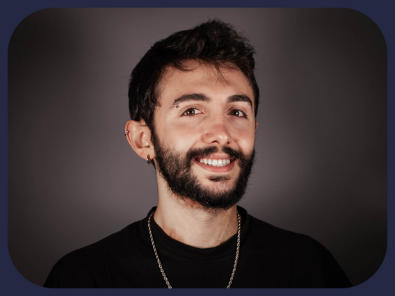
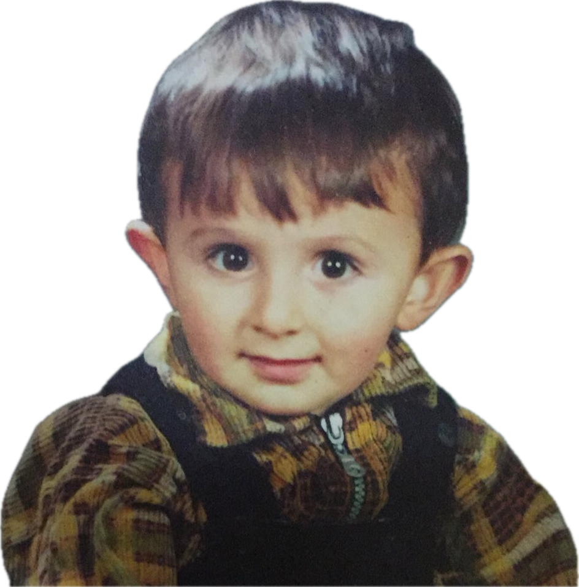

<!-- Main -->

<!-- One -->
<section id="one">
    

        <header class="major">
            <h1>Who do I think I am?</h1>
        </header>
        

            

                <!-- Content -->
		
I am a PhD student in Advanced Infrastructure Systems at Carnegie Mellon University. My research focuses on energy flexibility, smart grids, multi-agent reinforcement learning, and semantic technologies.

		
In my free time, I like to play with my cats, read about history, and drink fermented beverages.

		
So far, I have gotten 11 tattoos, backpacked throughout Europe for 2 months, survived mild hypothermia while camping during a snowstorm in Turkiye, lived in a hostel in Venice for 4 months, fermented my own wine and beer in Ankara, and have visited 50+ cities in 12 countries.

                <!-- Additional content here -->
        

        

            <!-- Place your image here -->
            
            <!-- Social Icons -->
	    

	        <ul class="icons">
	        <li><a href="https://twitter.com/ozanbarism" class="icon fa-twitter" style="font-size: 24px; padding: 10px 20px;">Twitter</a></li>
	        <li><a href="https://github.com/ozanbarism" class="icon fa-github" style="font-size: 24px; padding: 10px 20px;">Github</a></li>
	        <li><a href="https://www.linkedin.com/in/ozanbarismulayim" class="icon fa-linkedin" style="font-size: 24px; padding: 10px 20px;">LinkedIn</a></li>
	        <li><a href="mailto:omulayim@andrew.cmu.edu" class="icon fa-envelope" style="font-size: 24px; padding: 10px 20px;">Email</a></li>
	    </ul>
	

        

	

	    <h3>Education</h3>
	    <ul>
		    <li><strong>PhD in Advanced Infrastructure Systems</strong>, Carnegie Mellon University (2022-Present) - Pittsburgh, PA</li>
		    <li><strong>Master's in Advanced Infrastructure Systems</strong>, Carnegie Mellon University (2022-2023) - Pittsburgh, PA</li>
		    <li><strong>Bachelor's in Civil Engineering</strong>, Orta Dogu Teknik Universitesi (2016-2021) - Ankara, Türkiye</li>
	        <!-- Add more <li> elements for each institution you attended -->
	    </ul>
	

	

		<h3>Skills</h3>
		<ul>
		    <li><strong>Programming:</strong> Python, MATLAB, C++, SPARQL</li>
		    <li><strong>Deep Reinforcement Learning:</strong> PPO, MuZero, DDPG, A3C</li>
		    <li><strong>Data Science:</strong> Scikit-learn, Pandas, PyTorch, TensorFlow, Ray, PySpark</li>
		    <li><strong>Computer Vision:</strong> CNNs, Contrastive Learning</li>
		    <li><strong>Semantic Ontologies:</strong> Brick</li>
		    <li><strong>Signal Processing:</strong> Fourier Transforms, Filter Design, Convolution</li>
		    <li><strong>Genetic Algorithms</strong> NSGA-II, WOA, LM </li>
		    <li><strong>System Identification:</strong> SciPy, SysIdentPy</li>
		    <li><strong>Hardware:</strong> Particle Argon, Raspberry Pi</li>
		</ul>
	

	<!-- Break -->
	

		<h3>Professional Experience</h3>
		<ul>
		    <li><strong>Visiting Researcher</strong>, Politecnico Di Milano (04/2022 – 07/2022) - Milan, Italy
		        <ul>
		            <li>Guided preliminary design of bridges using Non-Dominated Sorting Genetic Algorithm-II (NSGA-II) focusing on environmental, economical, and aesthetic objectives.</li>
		        </ul>
		    </li>
			<li><strong>ERASMUS Intern</strong>, BOLINA Ingegneria S.R.L. (08/2021 – 11/2021) - Venice, Italy
			    <ul>
				<li>Conducted seismic risk analysis.</li>
				<li>Building Information Modeling of old Italian structures (with horrible drawings).</li>
				<li>Data-driven cost estimation of seismic renovation.</li>
			    </ul>
		    </li>
		    <li><strong>Engineer</strong>, BridgeWIZ Engineering (07/2020 – 10/2020) - Ankara, Turkey
		        <ul>
		            <li>Developed a camera and laser-based CNN application for measuring tree trunk diameters.</li>
		            <li>Implemented a physics-based ML approach for analyzing new seismic isolation bearings.</li>
		            <li>Performed drone-based site inspections and analyzed acceleration data from multiple bridges for damage detection.</li>
		        </ul>
		    </li>
		</ul>
	

<!-- Research Section -->

    <h3>Research Overview</h3>
    
My research focuses on advancing the field of Advanced Infrastructure Systems through innovative methodologies and technologies. Key areas include energy flexibility, smart grids, and the application of machine learning for infrastructure resilience.

    <!-- Button to detailed Research page -->
    <ul class="actions">
        <li><a href="https://www.ozanbaris.org/2-generic.html" class="button">Learn More About My Research</a></li>
    </ul>
<ul class="actions">
    <li><a href="assets/images/Ozan-Baris-Mulayim-CV.pdf" class="button" download><i class="fa fa-download"></i> Download My CV</a></li>
</ul>

<section id="team">
    <h2>Our Team</h2>
    

        

            
            <h3>Ozan Baris</h3>
            
but younger

        

        

            
            <h3>Porchie</h3>
            
Assistant to the regional manager

        

        

            
            <h3>Diego</h3>
            
Assistant to assistant to the regional manager

        

    

</section>

<ul class="actions">
    <li><a href="#" class="button special" id="endWorldButton">Button to End the World</a></li>
</ul>

