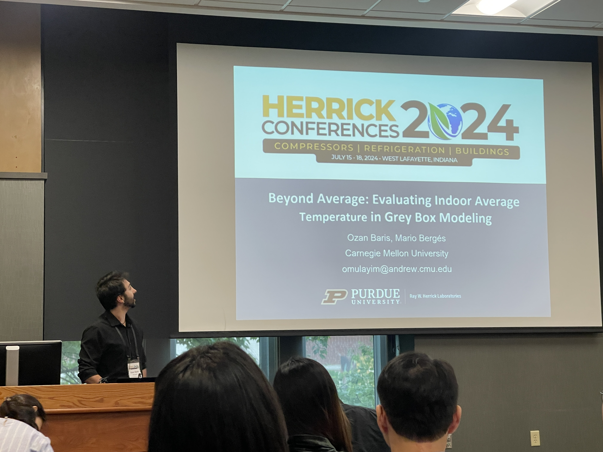
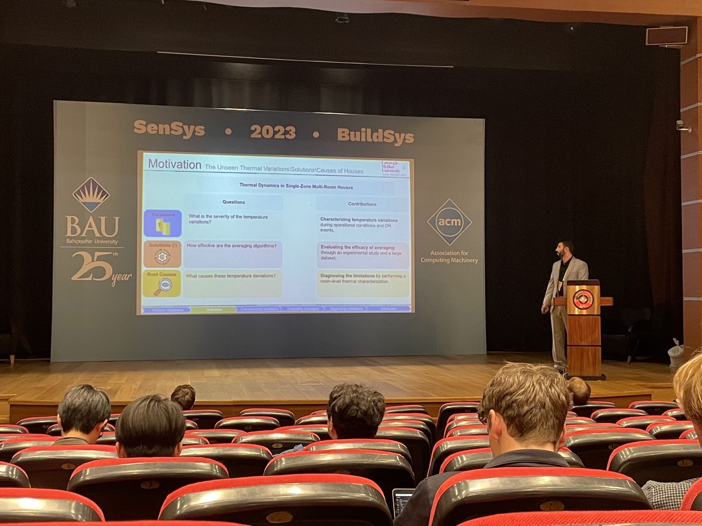
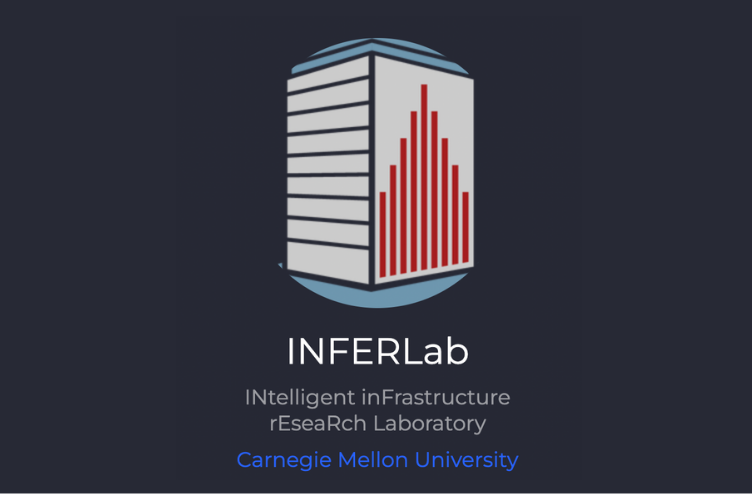

<!-- Update -->
<section id="update" class="spotlights">
        <section>
        
        

            

                <header class="major">
                   <h3>Herrick Conferences & IBO Workshop 2024</h3>
                </header>
                
Just got back from a fantastic gathering of minds at the High Performance Buildings Conference and the Intelligent Building Operations Workshop (IBO) at Herrick Labs, Purdue University! I had the pleasure of presenting our "beyond-average" paper, which was nominated for the best student paper—quite the thrill!

            

        

    </section>
    
</section>

<!-- One -->
<section id="one">
    

        <header class="major">
            <h2>IBO Workshop 2023</h2>
        </header>
        
I attended the 2023 Intelligent Building Operations Workshop, where I gained significant insights into real-world implementations, drawing from both current research and industry practices. My thanks go to the organizing team for bringing together such a great crowd.

    

</section>

<!-- Two -->
<section id="two" class="spotlights">
    <section>
        
        

            

                <header class="major">
                    <h3>BuildSys2023</h3>
                </header>
                
I had the opportunity to attend the 10th ACM International Conference on Systems for Energy-Efficient Buildings, Cities, and Transportation 🏙️, which took place in the beautiful (no bias introduced!) and historic city of Istanbul, Türkiye this year!

                <ul class="actions">
                    <li><a href="#!" class="button" onclick="toggleExtendedContent('extendedContent1')">Learn more</a></li>
                </ul>
                

                    
I have also had a chance to attend two workshops: 🌐 IEA EBC Annex 81 'Data-Driven Smart Buildings' Workshop on Smart Building-to-Grid Services and Applications (B2G'23), and 🔗 International Workshop on Cyber-Physical-Social Infrastructure Systems (CPSIS'23).

                    
Attending both the main conference and workshops was an electrifying ⚡ experience filled with innovative ideas and groundbreaking discussions! The best part? Getting to meet with experts who share a similar passion for decarbonization efforts. 🤝

                    
Additionally, I had the opportunity to present our paper with Mario Bergès 'Unmasking the Thermal Behavior of Single-Zone Multi-Room Houses: An Empirical Study'. 📊🏠

                    
Plus, I got to be the cultural ambassador and showcase a slice of my expertise about Türkiye to my fellow colleagues! 🇹🇷 They were surprised to see a city where it 'actually' rains cats and dogs outside! 🐈

                

            

        

    </section>
    <section>
        
        

            

                <header class="major">
                    <h3>Starting my PhD Journey</h3>
                </header>
                
I have begun my PhD journey at Carnegie Mellon University's INFERLab, under the supervision of Professor Mario Bergés. I'm truly excited to see where this adventure takes me!

            

        

    </section>
    <section>
        
        

            

                <header class="major">
                    <h3>Chosen as a Fulbright Scholar</h3>
                </header>
                
My family still brags about this but my close friends know that it was a mistake. Anyhow, though I am honored by the recognition, I had to turn it down.

            

        

    </section>
</section>

<!-- Three - Adjusted to mimic 'spotlights' layout -->
<section id="three" class="spotlights">
    <section>
        

            

                <header class="major">
                    <h2>Graduation from ODTU(METU)</h2>
                </header>
                
I graduated from the Civil Engineering Department at Orta Dogu Teknik Universitesi (ODTU), a journey for which I am profoundly grateful. I was also the top of my class though my close friends still do not understand how.

            

        

    </section>
</section>
